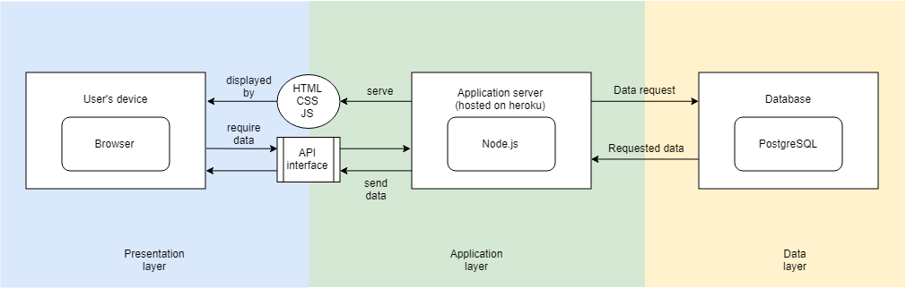
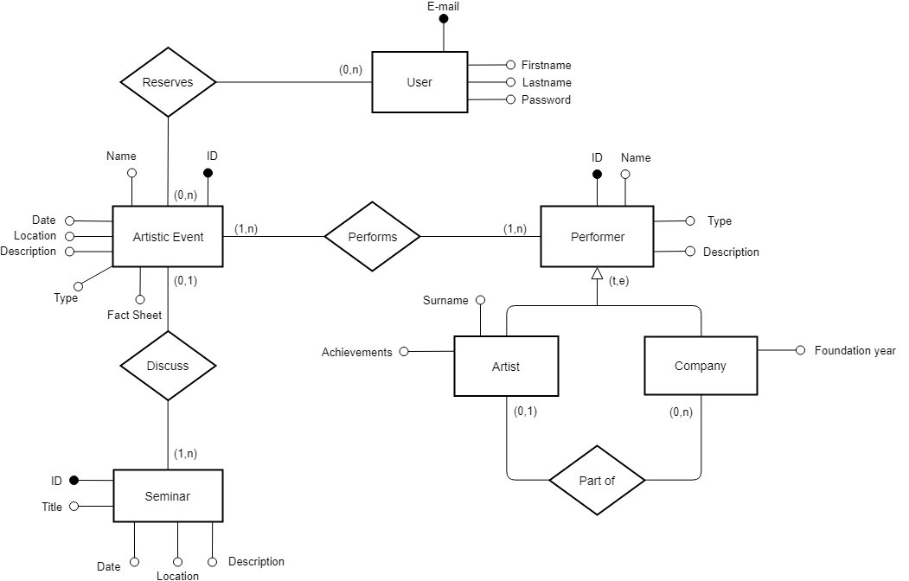

## General group information
| Member n. | Role | First name | Last Name | Matricola | Email address |
|-----------|---------------|------------|-----------|-----------|-----------------|
| 1 | administrator | Andrea | Falanti | 869429 | 10568850@polimi.it |
| 2 | member | Andrea | Smania | 869573 | 10568809@polimi.it |

## Links to other deliverables
- Deliverable D0: the web application is accessible at [this
address](https://example.com).
- Deliverable D2: the YAML or JSON file containing the specification
of the app API can be found at [this
address](https://example.com/backend/spec.yaml).
- Deliverable D3: the SwaggerUI page of the same API is available at
[this address](https://example.com/backend/swaggerui).
- Deliverable D4: the source code of D0 is available as a zip file at
[this address](https://example.com/backend/app.zip).
- Deliverable D5: the address of the online source control repository
is available at [this address](https://github.com/AndreaFalanti/Hypermedia-2019-september.git). We hereby
declare that this is a private repository and, upon request, we will
give access to the instructors.

## Specification

### Web Architecture
Describe here, with a diagram, the components of your web application
and how they interact. Highlight which parts belong to the application
layer, data layer or presentation layer. How did you ensure that HTML is
not rendered server side?

--The principal components of our website are an application server and
a database, that can be interrogated by clients with any browser application.
The application layer is composed by the application server, that use
Node.js to serve static files and provide API interface for client devices.
The data layer is composed by the database, running PostgreSQL, it's main role
is providing data requested by clients with API calls. Data layer and Application
layer are hosted on heroku, while presentation layer runs on client devices,
displaying assets with a browser. 

### API

#### REST compliance
Describe here to what extent did you follow REST principles and what are
the reasons for which you might have decided to diverge. Note, you must
not describe the whole API here, just the design decisions.

-- Our API follow 4 of the 5 guiding principles of a REST interface:
1) Contract first approach: it provides lot of URLs to get every information stored in our database, filtering them by 
their discriminating values, efficiently making a point of contact between server and frontend. It also provides URLs
used for important user interactions like registering and logging, covering all principal website functionality.
2) Statelessness: every API call provide complete information about object data transfered. If any object related to
fetched object is needed it could easily be fetched with a proper call, with this method there is less message overhead
when this additional info are not required.
3) Client-Server model: API are largely documented and provide a clear schema of data
provided, so that data can be easily retrieved by client side. Data format is not very granular
because our website data is pretty simple, but there is a lot of API calls granularity to
provide optimized calls for every situation.
4) Caching: caching is not supported by our API since it's not a requirement of the course
and because our data is quite simple, so response time is small enough even without it.
5) Layered architecture: our website use a standard 3-tier architecture. Client communicate
with server hosting the backend code that handles API calls, API code instead interrogate the data layer
to fetch the data that clients require to display the pages.

#### OpenAPI Resource models
Describe here synthetically, which models you have introduced for
resources.

-- The main resources of our web application are images, used as a thumbnail or in photo galleries
of some detail pages. We decided to use an array of image paths in our database for each object that
use a photo gallery, so that API calls can return it and from script we could easily set image
sources in html tags. Other data is only textual, so we used standard JSON format to return it (along
with the images array mentioned before).

### Data model
Describe with an ER diagram the model used in the data layer of your web
application. How these map to the OpenAPI data model?

--The model used in the data layer map the openAPI data model because the data is
fetched as it is from database and API specification file has a clear definition of each object type in
its "definitions" tag. Every object have listed all attributes with
corresponding types and examples.

## Implementation

### Tools used
Describe here which tools, languages and frameworks did you use for the
backend of the application.

-- For backend server we used javascript in a node.js environment, developed upon a
stub server generated by swagger editor. Swagger is a core component of our server, as
a framework for handling API calls and provide proper documentation in an easy way. Other
important npm packages used in the projects are serve-static for handling static assets
and cookie-parser and cookie-session for handling login with cookies. 

### Discussion
Describe here:
- How did you make sure your web application adheres to the provided
OpenAPI specification? Which method did you use to test all APIs
endpoints against the expected response?
- Why do you think your web application adheres to common practices to
partition a REST-based web application (static assets vs.
application data)
-- We think that our web application adheres to common practises
because most of our pages are dynamically generated from data fetched from
API calls, so that all objects of the same class can be displayed
using a single page layout and also if data change in future there
will be no problems with page updates (except if new data attributes
are necessary). Some pages use static data because are descriptive and
don't actually need to store data because they are the single topic pages
and data would not be used in other pages or layouts.
- Describe synthetically why and how did you manage session state,
what are the state change triggering actions (e.g., POST to login
etc..).
- Which technology did you use (relational or a no-SQL database) for
managing the data model?
-- We used a relational database (postgreSQL) for the data model,
because we are more experienced with a traditional SQL database
explained in our faculty courses.

## Other information

### Task assignment
Describe here how development tasks have been subdivided among members
of the group, e.g.:
> - Foo worked on front end (80%) and OpenAPI Spec (20% of the time)
> - Bar worked on ....

--
> - Andrea Falanti worked on back end (40%), database (10%), front end scripting (30%)
and openAPI spec (10%)
> - Andrea Smania worked on front end presentation (90%) and database (10%)

### Analysis of existing API
Describe here the research of (full or part of) existing APIs that are similar
in objectives and scope to the one implemented, that have possibly guided
implementation choices (these should not be necessarily OpenAPI
implementations). Toy APIs (such as the Swagger's Pet Store) or the example
shown during lectures are not a valid response.
Use TWO or more items of the form:
> We took (full/partial) inspiration from API <XYZ>(link) for the part of the
> API that manages <ABC> because of <REASON>.
Or
> For the part of the API that manages <ABC> we considered/studied <XYZ>(link)
> because of <REASON> but wasn't completely fitting to our purpose because of
> <REASON>.

-- We took full inspiration from Spotify API ([link](https://api.apis.guru/v2/specs/spotify.com/v1/swagger.yaml))
for API general structure and API URL endpoints, as we thought
it was more clear and easier to maintain and read then other API we search online.
Using parameters in path and defining clear object definition schemas we achieved
a similar result even if a lot more simplistic because we don't have in
our API specification OAuth authorization nor lot of query parameters like
Spotify ones.

We considered Gettyimages API ([link](https://api.apis.guru/v2/specs/gettyimages.com/3/swagger.yaml))
for the part that manages photos and we had confirm that using URI for
accessing images was a good practise, so that could also point to an
external site if in a professional case we would have used
a storage service for images. We didn't analyze to much the API because
was far too complex for our data model, opting for a more
simplistic approach.

### Learning outcome
What was the most important thing all the members have learned while
developing this part of the project, what questions remained unanswered,
how you will use what you've learned in your everyday life?

Examples:
- Foo learned to write SQL queries and Javascript but wanted to know
more about caching, he's probably going to create his own startup
with what she has learned
- Bar learned how to deploy on a cloud platform, he would have liked
to know more about promises for asynchronous code..